# Mars Mission Simulator

This project is a physics-based simulation of a simplified **Starship-like mission from Earth to Mars**.

The simulator is written in **C++**, while Python is used for plots and animations. The spacecraft starts near Earth after a simplified departure burn, travels through the Solar System, performs a Mars approach correction, enters the Martian atmosphere, slows down due to drag, and finally performs a terminal landing burn.

The project is simplified, but it shows the main physics behind an interplanetary mission in a clear numerical way.

---

## Preview

### Full mission animation

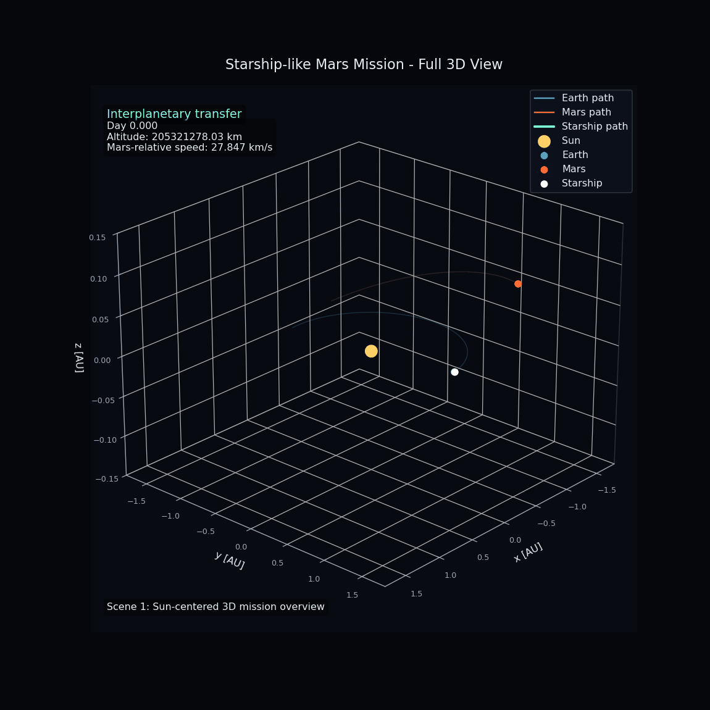

### Full Sun-centered trajectory

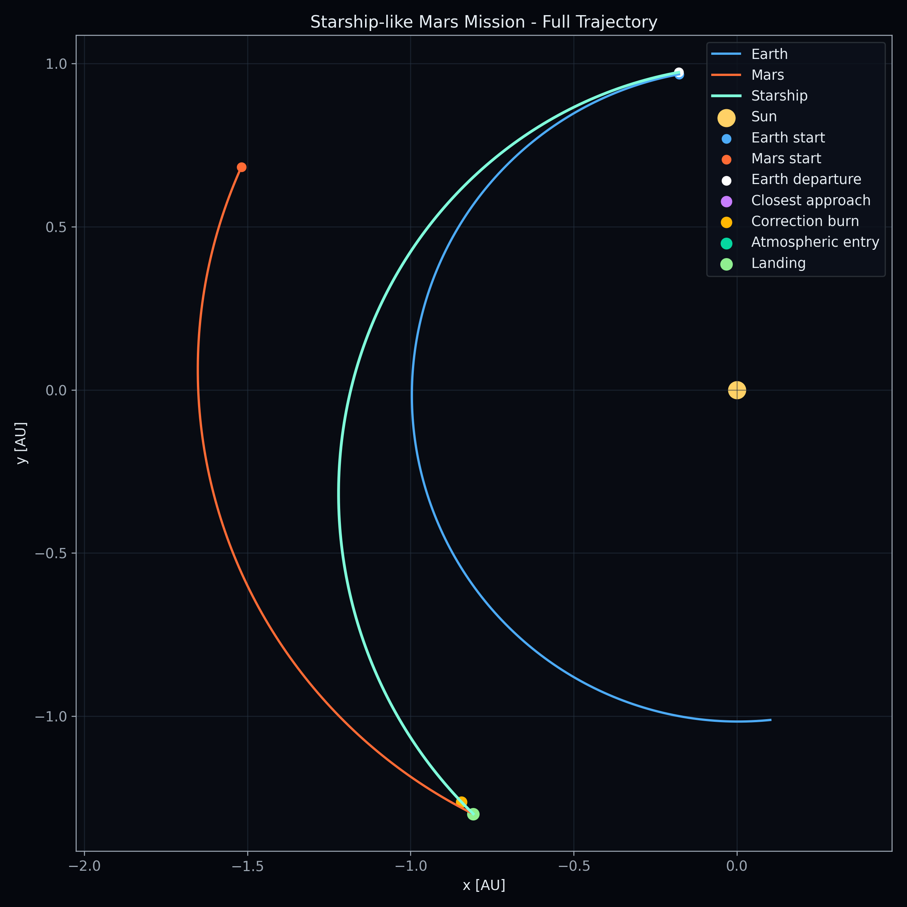

### 3D trajectory

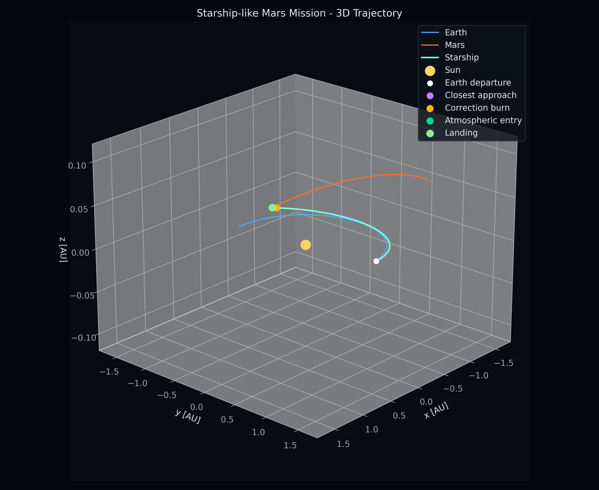

### Mars reentry close zoom

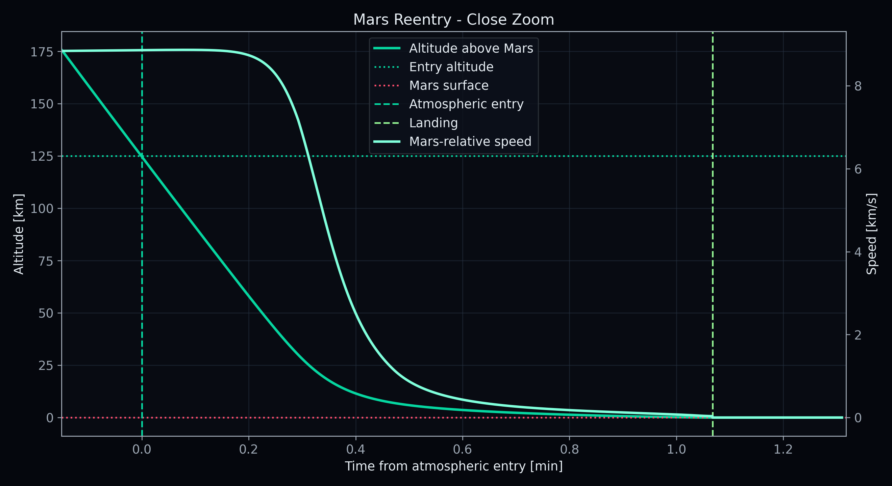

---

## Main idea

The spacecraft is propagated in a Sun-centered inertial reference frame.
Earth and Mars move around the Sun, while the spacecraft is updated step by step from the forces acting on it.

The mission contains the following stages:

1. departure from Earth
2. heliocentric transfer
3. Mars approach correction burn
4. atmospheric entry
5. aerodynamic braking
6. terminal landing burn

The trajectory is not manually drawn. It is calculated from the current position, velocity, gravity, mass, atmospheric density, drag force, and burn acceleration.

---

## Features

- 3D Sun-centered Solar System model
- elliptical Kepler orbits for Earth and Mars
- gravity from the Sun, Earth, and Mars
- fourth-order Runge-Kutta integration
- patched-conic Earth departure approximation
- Tsiolkovsky rocket equation for mass loss
- Mars approach correction burn
- exponential Mars atmosphere model
- aerodynamic drag during reentry
- simplified landing burn
- telemetry output
- plots and animated GIF visualization

---

## Physical model

The spacecraft state is described by its position and velocity:

```math
\vec{r} = (x,y,z)
```

```math
\vec{v} = (v_x,v_y,v_z)
```

The equations of motion are:

```math
\frac{d\vec{r}}{dt} = \vec{v}
```

```math
\frac{d\vec{v}}{dt} = \vec{a}
```

The total acceleration is calculated as:

```math
\vec{a}
=
\vec{a}_{grav}
+
\vec{a}_{drag}
+
\vec{a}_{burn}
```

Before atmospheric entry, the main force is gravity.
After atmospheric entry, drag becomes active.
Near the surface, the landing burn is added.

---

## Planetary motion

Earth and Mars are modeled using elliptical Keplerian orbits.

The mean anomaly is:

```math
M(t) = M_0 + nt
```

with:

```math
n = \sqrt{\frac{GM_{Sun}}{a^3}}
```

Kepler's equation is solved iteratively:

```math
M = E - e\sin E
```

where:

- `E` is the eccentric anomaly
- `e` is the eccentricity

The coordinates in the orbital plane are:

```math
x = a(\cos E - e)
```

```math
y = a\sqrt{1-e^2}\sin E
```

Then the position is rotated into 3D space using orbital inclination and orientation angles. This gives more realistic planet motion than simple circular orbits, while still keeping the code readable.

---

## Gravity model

The gravitational acceleration from one body is:

```math
\vec{a}_i
=
GM_i
\frac{\vec{r}_i - \vec{r}}
{|\vec{r}_i - \vec{r}|^3}
```

The total gravitational acceleration is:

```math
\vec{a}_{grav}
=
\vec{a}_{Sun}
+
\vec{a}_{Earth}
+
\vec{a}_{Mars}
```

This means that the spacecraft is affected by the gravity of all three bodies.
Before the atmosphere starts slowing the spacecraft down, Mars gravity pulls it inward and its Mars-relative speed increases.

---

## Numerical integration

The equations of motion are solved with the fourth-order Runge-Kutta method.

```math
k_1 = f(t, y)
```

```math
k_2 = f\left(t + \frac{\Delta t}{2}, y + \frac{\Delta t}{2}k_1\right)
```

```math
k_3 = f\left(t + \frac{\Delta t}{2}, y + \frac{\Delta t}{2}k_2\right)
```

```math
k_4 = f(t + \Delta t, y + \Delta t k_3)
```

```math
y_{n+1}
=
y_n
+
\frac{\Delta t}{6}
(k_1 + 2k_2 + 2k_3 + k_4)
```

RK4 was used because the mission lasts many months, so the numerical method has to be more stable than simple Euler integration.

---

## Earth departure

The first departure estimate is based on a Hohmann-like transfer from Earth's orbit to Mars' orbit.

The semi-major axis of the transfer ellipse is:

```math
a_t = \frac{r_E + r_M}{2}
```

The approximate transfer time is:

```math
t_H
=
\pi
\sqrt{
\frac{a_t^3}{GM_{Sun}}
}
```

Earth's orbital speed is:

```math
v_E
=
\sqrt{
\frac{GM_{Sun}}{r_E}
}
```

The transfer speed at Earth's orbit is:

```math
v_t
=
\sqrt{
GM_{Sun}
\left(
\frac{2}{r_E}
-
\frac{1}{a_t}
\right)
}
```

The hyperbolic excess velocity is estimated as:

```math
v_{\infty} = v_t - v_E
```

The departure burn from parking orbit is approximated by:

```math
\Delta v
=
\sqrt{v_{\infty}^2 + v_{esc}^2}
-
v_{parking}
```

where:

```math
v_{parking}
=
\sqrt{
\frac{GM_E}{r_{parking}}
}
```

```math
v_{esc}
=
\sqrt{
\frac{2GM_E}{r_{parking}}
}
```

This gives a reasonable first estimate for the Earth departure burn.

---

## Rocket equation and mass loss

The burns use the Tsiolkovsky rocket equation:

```math
\Delta v
=
v_e
\ln
\left(
\frac{m_0}{m_f}
\right)
```

Solving for the final mass:

```math
m_f
=
m_0
e^{-\Delta v/v_e}
```

where:

- `m0` is the mass before the burn
- `mf` is the mass after the burn
- `ve` is the effective exhaust velocity
- `Delta v` is the velocity change

This is used for:

- Earth departure burn
- Mars approach correction burn

Because of this, the spacecraft mass decreases after each propulsive maneuver.

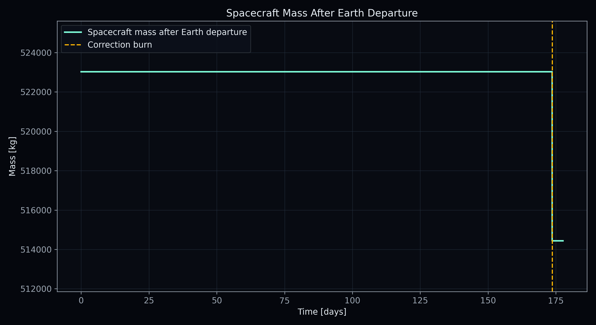

---

## Mars approach correction

The spacecraft usually does not naturally hit the exact entry corridor.
A small correction burn is applied during the Mars approach.

The Mars-relative position and velocity are:

```math
\vec{r}_{rel}
=
\vec{r}_{ship}
-
\vec{r}_{Mars}
```

```math
\vec{v}_{rel}
=
\vec{v}_{ship}
-
\vec{v}_{Mars}
```

The approximate time to closest approach is:

```math
t_c
=
-
\frac{
\vec{r}_{rel}
\cdot
\vec{v}_{rel}
}
{
|\vec{v}_{rel}|^2
}
```

The predicted closest position is:

```math
\vec{r}_{closest}
=
\vec{r}_{rel}
+
\vec{v}_{rel}t_c
```

The target is the atmospheric entry radius:

```math
r_{entry}
=
R_{Mars}
+
h_{entry}
```

with:

```math
h_{entry} = 125 \text{ km}
```

The correction burn shifts the predicted closest approach toward this radius.

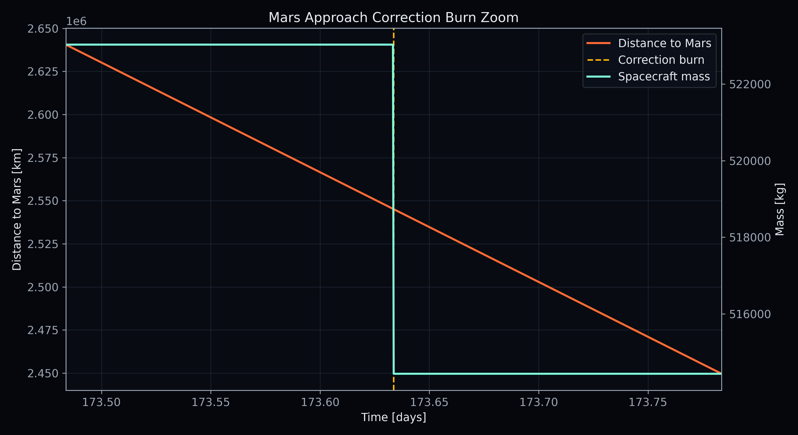

---

## Mars atmosphere

The atmosphere is modeled with a simple exponential density profile:

```math
\rho(h)
=
\rho_0
e^{-h/H}
```

where:

- `h` is altitude above Mars
- `rho0` is surface density
- `H` is scale height

The atmosphere starts affecting the spacecraft below the entry altitude:

```math
h \leq 125 \text{ km}
```

Before this point, the spacecraft mostly accelerates under gravity.
After this point, drag becomes strong and the velocity starts dropping quickly.

---

## Aerodynamic drag

The drag force is:

```math
F_D
=
\frac{1}{2}
\rho
C_D
A
v^2
```

where:

- `rho` is atmospheric density
- `CD` is drag coefficient
- `A` is effective drag area
- `v` is Mars-relative speed

The drag acceleration is:

```math
\vec{a}_{drag}
=
-
\frac{F_D}{m}
\frac{
\vec{v}_{rel}
}
{
|\vec{v}_{rel}|
}
```

The minus sign means that drag acts opposite to the spacecraft motion.

The Mars-relative speed is recalculated every timestep:

```math
v_{rel}
=
|
\vec{v}_{ship}
-
\vec{v}_{Mars}
|
```

This is why the reentry velocity plot is calculated live from the actual simulated motion.

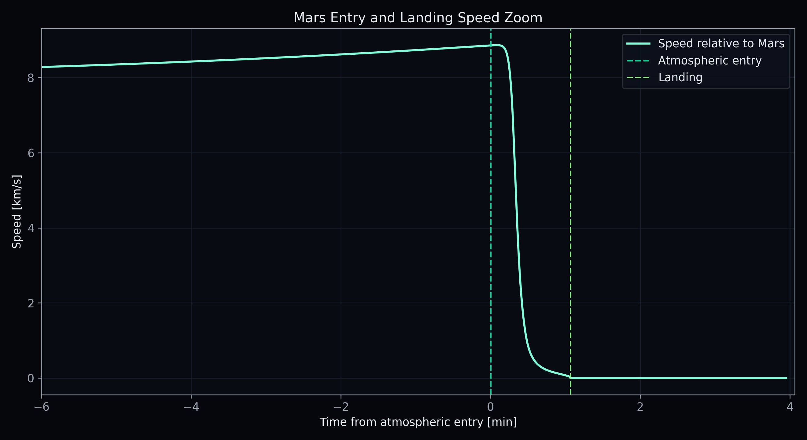

---

## Landing burn

Near the surface, a simplified terminal landing burn is applied.
The burn direction is opposite to the Mars-relative velocity:

```math
\vec{a}_{burn}
=
-
a_{burn}
\frac{
\vec{v}_{rel}
}
{
|\vec{v}_{rel}|
}
```

The target speed decreases with altitude:

```math
v_{target}
=
5
+
0.015h
```

If the current speed is larger than the target speed:

```math
v_{remove}
=
v
-
v_{target}
```

The required braking acceleration is estimated from:

```math
a_{req}
=
\frac{
v_{remove}^2
}
{
2h
}
```

The final burn acceleration is limited:

```math
a_{burn}
=
\min(a_{req}, a_{max})
```

This is not a complete landing guidance system, but it gives a clear final deceleration phase in the simulation.

---

## Entry and landing plots

The entry phase is where gravity, atmosphere, and landing burn act together.

### Altitude and speed during entry

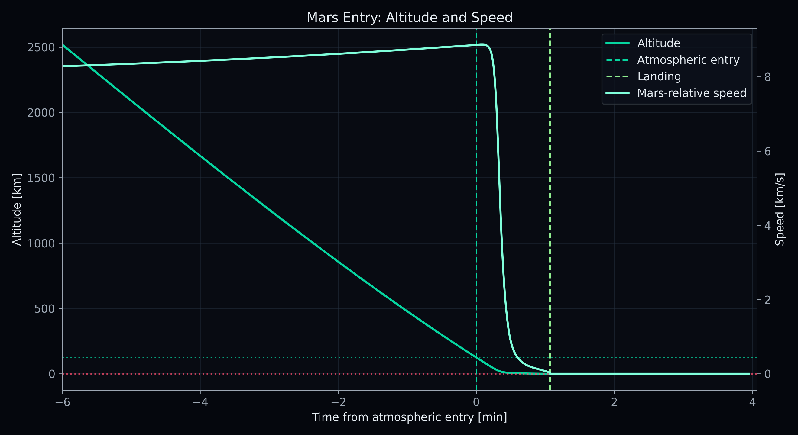

### Altitude zoom

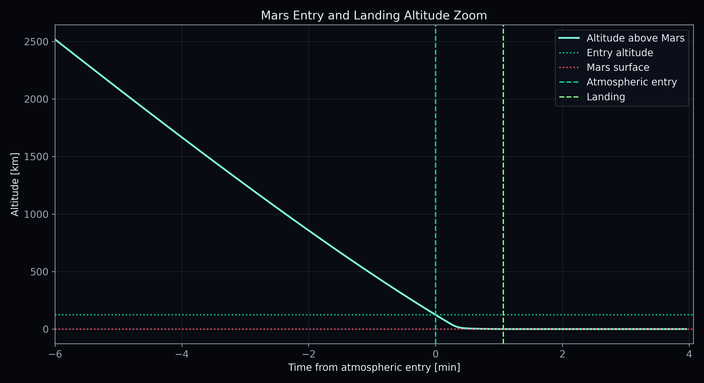

### Distance from Mars center

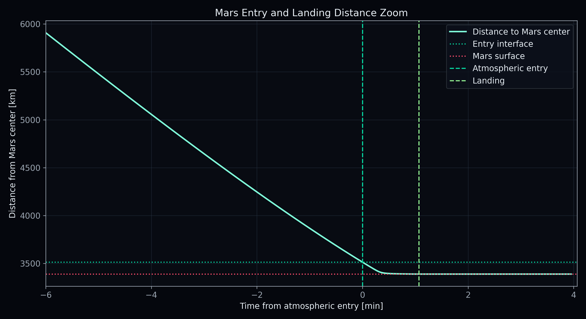

### One-minute reentry zoom


Before the atmosphere, the spacecraft can still speed up because Mars gravity is pulling it inward.
After atmospheric entry, density increases and drag rapidly slows the spacecraft down.
Near the surface, the landing burn reduces the Mars-relative speed to zero.

---

## Surface contact

Surface contact is detected when:

```math
h \leq 0
```

If the Mars-relative speed is below the touchdown limit, the mission is marked as landed:

```math
v_{rel}
\leq
v_{limit}
```

Otherwise, it is marked as impact.

After contact, the spacecraft is kept on the Mars surface for a short time. This makes the final part of the plots and animation easier to read.

---

## Distance and velocity profiles

### Distance profile

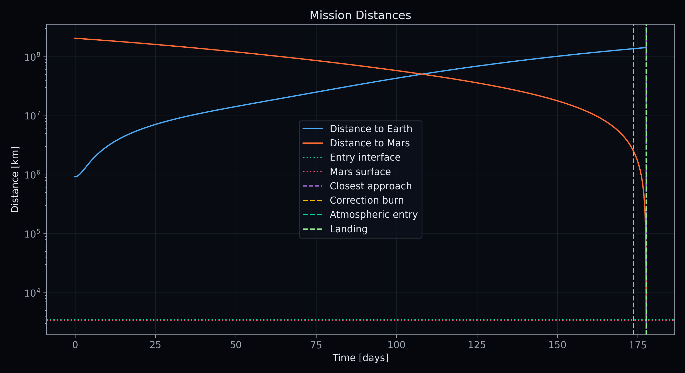

### Velocity profile

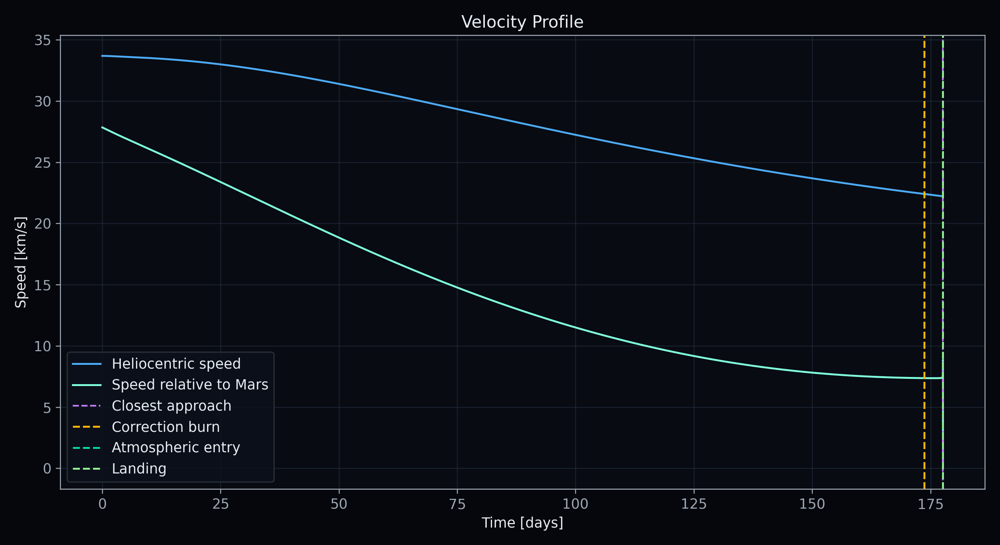

### Distance from the Sun

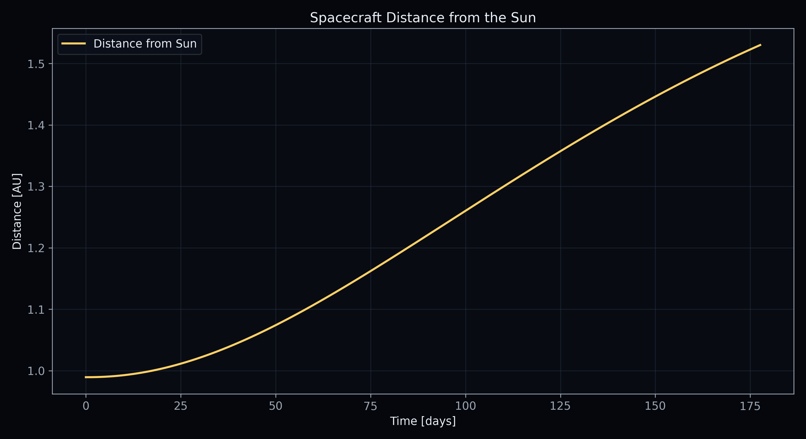

---

## Example mission result

Example output from the current simulation:

```txt
Mars phase = 2.79733 rad
launch delta-v factor = 1.03633
launch normal factor = -0.0751667

launch delta-v applied ≈ 3722 m/s
Mars approach correction delta-v ≈ 62 m/s
total propulsive delta-v applied ≈ 3784 m/s

atmospheric entry altitude = 125 km
Mars entry interface reached
aerodynamic braking active
terminal landing burn active
```

The exact values can change slightly depending on the timestep, drag area, drag coefficient, and landing burn parameters.

---

## Output files

The simulator writes data into the `results/` folder:

```txt
results/
├── trajectory.txt
├── trajectory3d.txt
├── telemetry.txt
└── summary.txt
```

The main telemetry columns are:

```txt
time [days]
distance to Earth [km]
distance to Mars [km]
distance from Sun [AU]
heliocentric speed [km/s]
Mars-relative speed [km/s]
spacecraft mass [kg]
entry flag
altitude above Mars [km]
landed flag
impact flag
correction burn flag
```

---

## Project structure

```txt
mars-mission-simulator/
├── README.md
├── src/
│   ├── main.cpp
│   ├── physics.cpp
│   ├── physics.h
│   ├── constants.h
│   ├── vector3.h
│   ├── body.h
│   └── spacecraft.h
│
├── scripts/
│   ├── plot.py
│   └── animate.py
│
├── results/
│   ├── trajectory.txt
│   ├── trajectory3d.txt
│   ├── telemetry.txt
│   └── summary.txt
│
└── figures/
    ├── trajectory_full.png
    ├── trajectory_3d.png
    ├── distance_profile.png
    ├── velocity_profile.png
    ├── mass_profile.png
    ├── sun_distance_profile.png
    ├── correction_burn_zoom.png
    ├── mars_reentry_1min_zoom.png
    ├── mars_entry_altitude_zoom.png
    ├── mars_entry_speed_zoom.png
    ├── mars_entry_distance_zoom.png
    ├── mars_entry_altitude_speed_panel.png
    └── mars_mission_smooth_zoom_dark.gif
```

---

## How to build and run

Compile the simulation:

```bash
g++ src/main.cpp src/physics.cpp -o mars.exe
```

Run it:

```bash
./mars.exe
```

Generate plots:

```bash
python scripts/plot.py
```

Generate animation:

```bash
python scripts/animate.py
```

---

## Simplifications

The project uses several simplifications:

- no real NASA/JPL ephemerides
- no Moon
- no launch site and no Earth rotation
- no lift or bank-angle control during entry
- no heat shield temperature model
- no detailed attitude controller
- simplified Mars atmosphere
- simplified landing burn
- simplified Mars approach targeting

The goal is not to reproduce a real SpaceX mission exactly.
The goal is to build a clear numerical physics simulation that shows the main structure of an Earth-to-Mars mission.

---

## Technologies

```txt
C++
Python
NumPy
Matplotlib
Numerical integration
Orbital mechanics
```

---

## Author

Patryk Kuna
